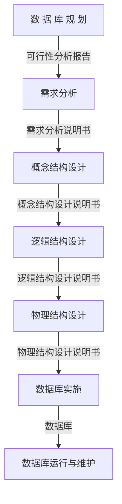

# Database Advanced

## Introduction

本次数据库的高级内容笔记我准备用双语（中文、英文）进行记录，英文部分使用的是百度翻译。

对于本文档适合具有数据库基础的同志。

`SQL server` 高级内容涉及了索引、事务、锁、T-SQL编程、触发器、存储过程、数据库设计、临时表、数据库优化、发布等。

>I am going to record the high-level content notes of this database in bilingual (Chinese and English), and the English part is Baidu Translator.
>
>This document is suitable for comrades with a database foundation.
>
>The advanced content of `SQL server` involves indexes, transactions, locks, T-SQL programming, triggers, stored procedures, database design, temporary tables, database optimization, publishing, etc.
>

## 1. Index and view(索引与视图)

### 1.1 Introduction

<B>Index(索引)</B>

`作用` : 当数据量非常庞大的时候，查询则会比较缓慢，通过索引可以大大的提高查询速度。

`定义` : 将数据结构中的一部分信息提取出来，重新组织，使其变得有一定的结构，这部分信息称为索引。

>
> `Function` : When the amount of data is very large, the query will be slow, and the index can greatly improve the query speed.
>
> `Definition` : Extract part of the information in the data structure, reorganize it, and make it have a certain structure. This part of information is called index.
>

<B>View(视图)</B>

视图是用于简化查询过程、提高数据库安全性的数据库虚拟表对象

### 1.2 Understand common data structures(了解常见的数据结构)

#### 1.2.1 Stack(栈)

`定义` : 只在一个方向(或一端)进行增删改查等操作的线性表。

`特点` : 先进后出、后进先出

类似与子弹上膛，最后压入的子弹最先打出。

>
> `Definition` : A linear table that can only be added, deleted, modified, or queried in one direction (or one end).
>
> `Features` : FIFO, LIFO
>
> Similar to the loading of a bullet, the last bullet pressed in is the first to shoot out.
>


#### 1.2.2 Queue(队列)

`定义` : 在一端进行删除元素，另一端进行增加元素的线性表。

`特点` : 先进先出。

类似于现实中的排队买单，最先排队的人最先走人。

>
> `Definition` : delete elements at one end and add elements at the other end.
>
> `Features` : First in, first out.
>
> Similar to the reality of queuing to pay the bill, the first person in line is the first to leave.
>


#### 1.2.3 Array(数组)


1、查询速度快：通过地址值与索引可快速定位到数据。

2、删除效率低：删除数据后，要将每个数据前移。

3、添加效率极低：添加位置后，每个数据都往后移，再添加数据。

>
> 1. Fast query speed: data can be quickly located through address value and index.
>
> 2. Low deletion efficiency: After deleting data, move each data forward.
>
> 3. The efficiency of adding is extremely low: after adding a location, each data is moved back and then added.
>

#### 1.2.4 Linked list(链表)


1、链接中的数据都是游离存储的，每个元素节点包含元素值与下一个元素地址。

2、查询速度慢，因为每次查询都要通过 `head` 指针依次查询

3、添加、删除效率较高，因为只需要将指针重新指向新添加进来的元素，其他元素不需要动。

>
> 1. The data in the link is stored freely. Each element node contains the element value and the address of the next element.
>
> 2. The query speed is slow because each query needs to be queried in turn through the 'head' pointer
>
> 3. The efficiency of adding and deleting is high, because you only need to re-point the pointer to the newly added element, and other elements do not need to be moved.
>


#### 1.2.5 Tree(树)

##### Binary Tree(二叉树))

二叉树全称二叉搜索树。存入的数据以第一条数据为基准，小于放左边，大于放右边。

1、只能有一个根节点，每个节点最多支持两个子节点。

2、节点的度：节点拥有的子树的个数。节点的度数不大于2。如果度数为0，则称该节点为叶子节点。

缺点：当节点较多时，会面临查找速度慢的情况，而且容易出现<b>退化链表</b>情况。

>
> The full name of binary tree is binary search tree. The stored data is based on the first data, which is smaller than the left and larger than the right.
>
> 1. There can only be one root node, and each node can support up to two child nodes.
>
> 2. Node degree: the number of subtrees owned by the node. The degree of the node is not greater than 2. If the degree is 0, the node is called a leaf node.
>
> `Disadvantages` : When there are many nodes, the search speed will be slow, and it is easy to degenerate the linked list.


##### Balanced Binary Tree(平衡二叉树)

平衡二叉树是在满足二叉查找树的情况下，尽可能的让树的度数变低以提高效率。

> The balanced binary tree is to reduce the degree of the tree as much as possible to improve efficiency under the condition of satisfying the binary search tree.


要求：任意节点的两个左右子树高度差不超过1，任意节点的左右子树都是一个平衡二叉树。

> Requirements: The height difference between the two left and right subtrees of any node shall not exceed 1, and the left and right subtrees of any node shall be a balanced binary tree.


底层在二叉树的基础上，对进行插入和删除操作时通过特定的操作（左旋，右旋）保持二叉树的平衡，从而获得较高的性能。

> On the basis of the binary tree, the bottom layer maintains the balance of the binary tree through specific operations (left and right) when performing insert and delete operations, so as to achieve high performance.

```txt
左旋转：被旋转的节点从左侧上升到父节点
右旋转：被旋转的节点从右侧上升到父节点

Left rotation: the rotated node rises from the left to the parent node
Right rotation: the rotated node rises from the right to the parent node
```

**缺点：**

+ 树的深度过高
+ 无法解决回旋查找问题
+ 添加节点的效率过低，发生旋转时容易发生

**Disadvantages:**

+ The depth of the tree is too high
+ Unable to resolve the roundabout lookup problem
+ The efficiency of adding nodes is too low, which is easy to occur when rotation occurs

##### Red Black Tree(红黑树)

红黑树是一种自平衡二叉查找树，是计算机中用到的一种数据结构。每一个节点可以是红或者黑；红黑树不是通过高度平衡的，它的平衡是通过 `红黑规则` 进行实现的。

>The red-black tree is a self-balanced binary search tree, which is a data structure used in computers. Each node can be red or black; The red-black tree is not balanced by height. Its balance is achieved by the `red-black rule`.


**红黑规则：**

+ 每一个节点为红色或黑色，根节点必须是黑色的。
+ 如果某一个节点是红色，那么它的子节点必须是黑色的（不能出现两个红色节点相连的情况）。
+ 对每一个节点，从该节点到其所有后代叶节点的简单路径上，均包含相同数目的黑色节点。
+ 如果一个节点没有子节点或者父节点，则该节点的相应指针属性值为 `NULL` ，这些 `NULL` 都视为叶节点，叶节点是黑色。

**Red and black rules:**

+ Each node is red or black, and the root node must be black.
+ If a node is red, its child nodes must be black (two red nodes cannot be connected).
+ For each node, the simple path from this node to all its descendant leaf nodes contains the same number of black nodes.
+ If a node has no child node or parent node, the corresponding pointer attribute value of the node is `NULL`. These `NULL` are considered as leaf nodes, and the leaf nodes are black.

**添加节点：**

+ 添加的节点颜色，可以是红色也可以是黑色
+ 默认使用红色效率高

**Add node:**

+ The added node color can be red or black
+ It is efficient to use red by default

##### B Tree(B 树)

B 树又称为多路平衡树，在树的基础上对节点进行横向拉伸。

> B-tree is also called multi-channel balanced tree, which stretches nodes horizontally on the basis of the tree.

**特点：**

+ 所有键值分布在整棵树中（索引值与具体 data 都在每个节点里）
+ 任何一个关键字出现且只出现在一个节点中
+ 搜索可能在非叶子节点结束
+ 在关键字全集内做一次查找，性能接近二分查找

**Features:**

+ All key values are distributed in the whole tree (index values and specific data are in each node)
+ Any keyword appears in only one node
+ Search may end at a non-leaf node
+ Perform a search in the complete set of keywords, and the performance is close to binary search


**规则：**

+ 每个结点最多有 m 棵子树（m 为阶）。
+ 除根节点外，其他每个分支节点至少 `ceiling` (m/2) 棵子树【ceiling 表示向上取整】。
+ 根节点至少包含两棵子树（除非 B 树只包含一个节点）。
+ 所有叶子节点在同一层上，B 树叶子节点可以是外部节点，不包含任何信息。
+ 有 j 个孩子的非叶子节点恰好有 j-1 个关键字，关键字按递增次序排列。

**Rules:**

+ Each node can have up to m subtrees (m is the order).
+ Except for the root node, each branch node has at least 'ceiling' (m/2) subtrees [ceiling means rounding up].
+ The root node contains at least two subtrees (unless the B-tree contains only one node).
+ All leaf nodes are on the same layer, and B-tree leaf nodes can be external nodes that do not contain any information.
+ A non leaf node with j children happens to have j-1 keywords, which are arranged in ascending order.

##### B + Tree

也是一种多路搜索树

**m 阶 B+ 树特点：**

+ 每个节点至多有 m 个子女。
+ 非根节点关键值个数范围：`ceiling(m/2)-1 <= k <= m-1` 。
+ 相邻叶子节点是通过指针连起来，且按关键字大小排序。

**M-level B+tree features:**

+ Each node can have up to m children.
+ The range of key values for non root nodes: `ceiling (m/2) - 1<=k<=m-1` .
+ Adjacent leaf nodes are connected by pointers and sorted by keyword size.


### 1.2 Index

**聚集索引：**

+ 该索引中键值的逻辑顺序决定了表中相应的物理顺序
+ 聚焦索引是物理地址连续存放的索引
+ 只能有一个，一般为主键（主键一定是聚集索引，聚集索引不一定是主键）
+ 建表时没有设置主键，此时建立了聚集索引再设立主键，那么该主键就不是聚集索引

**Clustered index:**

+ The logical order of key values in the index determines the corresponding physical order in the table
+ The focus index is an index that continuously stores physical addresses
+ There can only be one, usually the primary key (the primary key must be a clustered index, and the clustered index must not be a primary key)
+ The primary key is not set when the table is created. If the primary key is set after the clustered index is created, the primary key is not a clustered index

**非聚集索引：**

非聚集索引是表中记录的物理顺序和逻辑顺序不同的索引，可以有多个。

**`Nonclustered index` :**
A nonclustered index is an index with different physical and logical order of records in a table, and can have multiple indexes.

**特点：**

+ 每张表上最大的聚集索引数为1
+ 每张表上最大的非聚集索引数为999
+ 每个索引最多能包含的键列数为16
+ 索引键记录大小最多为900字节

**Features:**

+ The maximum number of clustered indexes on each table is 1
+ The maximum number of non-clustered indexes on each table is 999
+ The maximum number of key columns per index is 16
+ Index key record size is up to 900 bytes

#### 1.2.1 Index data structure（索引数据结构）

在 `SQL Server` 数据库中，索引的存储是以B+树（(注意和二叉树的区别)结构来存储的，又称索引树，其节点类型为如下两种:

+ 索引节点(Key) 。
+ 叶子节点( Key + Value)。

索引节点按照层级关系，有时又可以分为根节点和中间节点，其本质是一样的，都只包含下一层节点的入口值和入口指针。

叶子节点就不同了，它包含数据，这个数据可能是表中真实的数据行，也有可能是索引列值和行书签，前者对应于聚集索引，后者对应于非聚集索引。

B+Tree:一种数据结构(也是一种多路平衡搜索树)

数据页:数据库保存数据的最小单位。( `SQL Server` 一个数据页的大小是8K，一个表中所有的数据都被保存到一个个的数据页中)

索引组织表: 一张表有聚集索引就是索引组织表(把表中的数据页以 B+ Tree 的方式组织起来)索引表:一个索引对应一张索引表，索引表中每条数据都对应一张数据页

In a `SQL Server` database, indexes are stored in a B+tree (note the difference between a binary tree and a binary tree) structure, also known as an index tree, with the following two node types:

+ Index node (Key).
+ Leaf node (Key+Value).

Index nodes can be divided into root nodes and intermediate nodes according to hierarchical relationships, and their essence is the same. They only contain the entry values and entry pointers of the nodes at the next level.

Leaf nodes are different. They contain data, which may be actual data rows in a table, or index column values, which correspond to clustered indexes, and row labels, which correspond to non clustered indexes.

B+Tree:  A data structure (also a multi way balanced search tree)

Data Page: The smallest unit in which a database stores data. "The size of a data page in `SQL Server` is 8K, and all data in a table is saved to data pages one by one."

Index organization table: A table with a clustered index is an index organization table (organizing the data pages in the table in a B+Tree manner) Index table: An index corresponds to an index table, and each data in the index table corresponds to a data page

#### 1.2.2 Why choose B+tree? （为什么选择 B+ 树）

1、B+树的磁盘读写代价更低:B+树的内部节点并没有指向关键字具体信息的指针，因此其内部节点相对B树更小，如果把所有同一内部节点的关键字存放在同一盘块中，那么盘块所能容纳的关键字数量也越多，一次性读入内存的需要查找的关键字也就越多，相对IO读写次数就降低了。

2、B+树的查询效率更加稳定:由于非终结点并不是最终指向文件内容的结点，而只是叶子结点中关键字的索引。所以任何关键字的查找必须走一条从根结点到叶子结点的路。所有关键字查询的路径长度相同，导致每一个数据的查询效率相当。

3、由于B+树的数据都存储在叶子结点中，分支结点均为索引，方便扫库，只需要扫一遍叶子结点即可，但是B树因为其分支结点同样存储着数据，我们要找到具体的数据，需要进行一次中序遍历按序来扫，所以B+树更加适合在区间查询的情况，所以通常B+树用于数据库索引。

数据库索引采用B+树的主要原因是: B树在提高了 `IO` 性能的同时并没有解决元素遍历效率低下的问题，正是为了解决这个问题，B+ 树应用而生。B+ 树只需要去遍历叶子节点就可以实现整棵树的遍历。而且在数据库中基于范围的查询是非常频繁的，而B树不支持这样的操作或者说效率太低。

1. "The disk read and write cost of a B+tree is lower: The internal nodes of a B+tree do not have pointers to specific information about keywords, so their internal nodes are smaller than those of a B tree. If all the keywords of the same internal node are stored in the same disk block, the more key words the disk block can hold, the more keywords that need to be searched for once to read into memory, and the relative IO read and write times are reduced.".
2. The query efficiency of B+trees is more stable: Because non endpoints are not the nodes that ultimately point to the file content, they are only the index of keywords in the leaf nodes. Therefore, any keyword search must follow a path from the root node to the leaf node. The path length for all keyword queries is the same, resulting in equivalent query efficiency for each data.
3. "Because the data of a B+tree is stored in leaf nodes, and the branch nodes are all indexes, which is convenient for scanning the database. It is only necessary to scan the leaf nodes once. However, because the branch nodes of a B tree also store data, we need to perform a middle order traversal to scan the specific data in order. Therefore, B+trees are more suitable for querying in intervals, so B+trees are usually used for database indexing.".
The main reason for using B+trees for database indexing is that B trees improve the 'IO' performance while not solving the problem of inefficient element traversal. It is precisely to solve this problem that B+trees are applied. A B+tree only needs to traverse leaf nodes to traverse the entire tree. Moreover, range based queries are very frequent in databases, and B-trees do not support such operations or are inefficient.

#### 1.2.3 Index design principles （索引设计原则）

1. 索引也是需要空间存储，索引太多意味着占用的空间也越多。
2. 索引页也需要系统维护，在增、删、改数据时索引需要重新编排。就好像一本书某一页被撕掉了，对应的目录也需要重新进行编排。
3. 索引堆积久了，由于维护数据过程中会产生过多的索引碎片，反而不利于数据查询。

1. Indexes also require spatial storage. Too many indexes mean that they occupy more space.
2. The index page also requires system maintenance, and the index needs to be reorganized when adding, deleting, or modifying data. It's like a page in a book is torn off, and the corresponding table of contents needs to be rearranged.
3. Indexes accumulate for a long time, and excessive index fragments may be generated during data maintenance, which is not conducive to data query.

**When is indexing established?（什么情况下建立索引）：**

1. 主键一定要建 `The primary key must be created.`

2. 外键一定要 `Foreign keys are essential.`

3. 经常查询的列 `Frequently queried columns.`
4. 经常用作查询条件的列 `Columns frequently used as query criteria.`
5. 经常用在 `order by`, `group by`, `distinct` 后面的列
6. 重复值比较多的列不能建立索引 `Columns with more duplicate values cannot be indexed.`
7. 对于 `text`, `image`, `bit` 这些类型的字段不能建立索引
8. 经常存取的列不要建立索引 **Do not index frequently accessed columns.**

#### 1.2.4 Use index（使用索引）

```sql
-- 创建索引的语法
-- Syntax for creating an index
CREATE [unique] [clustered / nonclustered]
index index_name
on table_name(column_name1, ……)
```

`unique` 唯一索引

`clustered` 聚集索引

`nonclustered` 非聚集索引

``` sql
-- 建立聚集索引	Building a clustered index
create clustered index id_userinfo_Id on UserInfo(Id);

-- 建立非聚集索引	Building a non clustered index
create nonclustered index id_userinfo_Account on UserInfo(Account);

-- 创建唯一非聚集索引	Create a unique non clustered index
create unique nonclustered index id_userinfo_Pwd on UserInfo(Pwd);

-- ☆ unique 索引字段必须唯一，但可以有一个值为 NULL
-- ☆ The unique index field must be unique, but can have a value of NULL.
```

```sql
-- 重命名索引	Rename Index
-- exec sp_rename '表名.旧索引名','新索引名', 'index';

-- 删除索引	Delete Index
-- drop index index_name on table_name;

-- 重建索引	Reindex
-- alter index index_name on table_name rebuild
```


### 1.3 View（视图）

`作用` 提高安全性；简化查询过程

`本质` 相当于封装好的 `SQL` 

`Function` Improve safety; Simplify the query process
`essence` Equivalent to packaged ` SQL`

```sql
-- 创建视图
Create view view_name
as
select column_name from table_name [where……]

-- 例
create view view_studentscore
as
select a.*,b.Degree,c.cno,cname , d.*from student a
inner join score b on a.sno=b.Sno
inner join course c on b.cno=c.Cno
inner join Teacher d on c.Tno=d.Tno

-- 使用视图
select * from view_studentscore

-- 修改视图
alter view v_studentscore
-- with encryption --加密。加密后注意保存代码
as
select a.*,b.Degree,c.cno,Cname ,d.* from student a
inner join score b on a.Sno=b. Sno
inner join course c on b.cno=c.Cno
inner join Teacher d on c.Tno=d.Tno

-- 删除视图
drop view view_name
```

## 2. Transaction(事务)

什么是事务: 在实际的开发过程中，一个业务操作如:转账，往往是要多次访问数据库才能完成的。转账是一个用户扣钱，另一个角户加钱。如果其中有一条 `SQL` 语句出现异常，这条 `SQL` 就可能执行失败。事务执行是一个整体，所有的 `SQL` 语句都必须执行成功。如果其中有1条 `SQL` 语句出现异常，则所有的 `SQL` 语句都要回滚，整个业务执行失败。

What is a transaction? In the actual development process, a business operation, such as transfer, often requires multiple accesses to the database to complete. Transfer is where one user deducts money and another corner account adds money. If an exception occurs in one of the `SQL`'statements, the `SQL` statement may fail to execute. Transaction execution is a whole, and all `SQL` statements must be executed successfully. If an exception occurs in one of the `SQL` statements, all `SQL` statements will be rolled back, and the entire business execution will fail.

```sql
-- transaction / tran

-- 模拟转账操作
begin transaction -- 开启事务
begin try	-- try语句
	-- 需要执行的 SQL 语句
	update account set balance=balance-1000 where name='广东曹贼';
	update account set balance=balance+1000 where name='东北孙权';
	commit;	-- 提交事物
end try	-- 结束try
begin catch	-- catch语句
	rollback;	-- 回滚事务
end catch
```

`原理` 事务开启之后，所有的操作都会临时保存到事务日志中，事务日志只有在得到 `commit` 命令才会同步到数据表中，其他任何情况都会清空事务日志(`rollback`，断开连接)

`执行步骤` 

1. 客户端连接数据库服务器，创建连接时创建此用户临时日志文件
2. 开启事务以后，所有的操作都会先写入到临时日志文件
3. 所有的查询操作从表中查询，但会经过日志文件加工后才返回
4. 如果事务提交则将日志文件中的数据写到表中，否则清空日志文件。

`事物特性`

+ Atomic(原子性)︰事务中包含的操作被看做一个逻辑单元，这个逻辑单元中的操作要么全部成功，要么全部失败。
+ Consistency (一致性)︰事务完成时，数据必须处于一致状态，数据的完整性约束没有被破坏，事务在执行过程中发生错误，会被回滚(Rollback)到事务开始前的状态，就像这个事务从来没有执行过一样。如: 转账前2个人的总金额是2000，转账后2个人总金额也是2000。
+ Isolation(隔离性)∶事务允许多个用户对同一个数据进行并发访问，而不破坏数据的正确性和完整性。同时，并行事务的修改必须与其他并行事务的修改相互独立。
+ Durability (持久性)∶事务结束后，事务处理的结果必须能够得到固化(永久存储到数据库中了)。就算断电了，也是保存下来的。

### 2.1 事务的隔离

事务在操作时的理想状态：所有的事务之间保持隔离，互不影响。因为并发问题，多个用户同时访问同一个数据从而引发的问题。

| 并发访问问题 | 含义 |
| :--- | :--- |
| 脏读 | 一个事务读取到另一个事务中尚未提交的数据 |
| 不可重复读 | 一个事务中两次读取的数据内容不一致，要求的是一个事务中多次读取时数据是一致的，这是事务 update 时引发的问题 |
| 幻读 | 一个事务中两次读取的数据的数量不一致，要求在一个事务多次读取的数据的数量是一致 |

**隔离级别** 

1~4，1级最低。“是” 表示会出现这种问题，“否” 表示不会出现这种问题

| 级别     | 名称     | 隔离级别         | 脏读 | 不可重复读 | 幻读 |
| -------- | -------- | ---------------- | ---- | ---------- | ---- |
| 1        | 读未提交 | read uncommitted | 是   | 是         | 是   |
| 2        | 读已提交 | read committed   | 否   | 是         | 是   |
| 3        | 可重复读 | repeatable read  | 否   | 否         | 是   |
| 4        | 串行化   | serializable     | 否   | 否         | 否   |
| 2~3 之间 | 快照     | SNAPSHOT         | 否   | 否         | 否   |

> 隔离级别越高，性能越差，安全性越高。
>
> ```sql
> -- 查看当前隔离级别
> DBCC Useroptions;
> 
> -- 设置隔离级别
> set transaction isolation level [隔离级别]
> 
> -- 例
> set transaction isolation level read uncommitted
> 
> ```

### 2.2 事务的快照

`SNAPSHOT` 快照: `SNAPSHOT` 和 `READ COMMITTED SNAPSHOT` 两种隔离(可以把事务已经提交的行的上一版本保存在 `TEMPDB` 数据库中)

`SNAPSHOT` 隔离级别在逻辑上与 `SERIALIZABLE`类似

`READ COMMITTED SNAPSHOT` 隔离级别在逻辑上与 `READ COMMITTED` 类似

不过在快照隔离级别下读操作不需要申请获得共享锁，所以即便是数据已经存在排他锁也不影响读操作。而且仍然可以得到和`SERIALIZABLE` 与 `READ COMMITTED` 隔离级别类似的一致性;如果目前版本与预期的版本不一致，读操作可以从 `TEMPDB` 中获取预期的版本。

如果启用任何一种基于快照的隔离级别，DELETE和UPDATE语句在做出修改前都会把行的当前版本复制到 `TEMPDB` 中，而INSERT语句不需要在 `TEMPDB` 中进行版本控制，因为此时还没有行的旧数据

| 事务ID | 数据ID | 数据版本                                        |
| ------ | ------ | ----------------------------------------------- |
| １     | １     | 1（快照）                                       |
| ２     | １     | 2（如果版本不一致，则事务将会获取版本１的数据） |

**作用:**

+　读操作时不会陷入block和死锁的问题中，SNAPSHOT本身提高了数据库系统的事务处理的性能。

+　避免了脏读，非一致性读，以及丢失更新，和不可重复读等多个问题

## 3. Lock(锁)

锁是多用户访问同一数据库资源时，对访问的先后次序权限管理的机制

分类

+　共享锁
+　排他锁
+　更新锁
+　架构锁
+　意向锁
+　大容量锁

`悲观锁`

总是假设最坏的情况，每次去拿数据的时候都认为别人会修改，所以每次在拿数据的时候都会上锁，这样别人想拿这个数据就会阻塞直到它拿到锁（**共享资源每次只给一个线程使用，其它线程阻塞，用完后再把资源转让给其它线程**)。传统的关系型数据库里边就用到了很多这种锁机制，比如行锁，表锁等，读锁，写锁等，都是在做操作之前先上锁。

`乐观锁`

总是假设最好的情况，每次去拿数据的时候都认为别人不会修改，所以不会上锁，但是在更新的时候会判断一下在此期间别人有没有去更新这个数据，可以使用版本号机制和 `CAS` 算法实现。**乐观锁适用于多读的应用类型，这样可以提高吞吐量**，像数据库提供的类似于`write_condition机制`，其实都是提供的乐观锁。

###  3.1 `rowlock`（行锁）

```sql
-- 关键字 rowlock
select colName from TabelName rowlock [where id=1]

-- 在 SQL 语句添加关键字 rowlock 会将该语句的内容锁住
-- 仍然可以操作该表中的其他内容
-- 不加 where 条件则将整个表锁住
```


### 3.2 `tableLockX`（表锁）

```sql
-- 关键字 tableLockX
select colName from TableName tableLockX where id=2

-- 在 SQL 语句添加关键字 tableLockX 会将该表锁住
-- 无法操作其他内容
-- where 条件不会限制锁住的内容
```


### 3.3 `S 锁`（共享锁）

共享锁是用于读取数据操作，允许多个事务读取相同的数据，但不允许其他事务修改当前数据。

```sql
-- 窗口1（添加共享锁)
begin tran
select * from account with(ho1d1ock) where id=1;
waitfor delay '00:00: 10';
commit;

-- 窗口2(可读)
begin tran
select * from account where id=1;
commit;

-- 窗口3（等待窗口1结束，才可执行)begin tran
update account set balance=500 where id=1;
commit;

```

### 3.4 Exclusive Locks（排他锁，简称X锁）

又称为独占锁，当事务对数据资源进行增删改操作时，不允许其它任何事务操作这块资源(可以读取)。防止对同一资源进行多重操作。

```sql
-- 窗口1
begin tran;
update account set balance=500 where id=1; -- 更新锁自动转换为排它锁
-- 等效于update account with(updlock) set balance=500 where id=1
waitfor de1ay '00:00:10';
commit;

-- 窗口2(可读)
begin tran;
select * from account;
commit;

-- 窗口3（等待窗口1结束才会执行）
begin tran
update account set balance=1500 where id=1;
commit;

```

### 3.5 更新丢失

第一类丢失更新(通过设置隔离级别可以防止 Repeatable Read)

+ A事务撤销时，把已经提交的B事务的更新数据覆盖了。这种错误可能造成很严重的问题。

第二类丢失更新(需要应用程序控制，乐观锁)

+ A事务覆盖B事务已经提交的数据，造成B事务所做操作丢失。

**更新锁**

目前更新丢失问题目前无法重现，因为系统在执行update语句时，会自带更新锁，在更新数据时，会将更新锁自动转换为排它锁(别人只能读)。

```sql
update account with(upd1ock) set bal1ance=1000 where id=1
```

###  3.6 死锁

在多个任务中，每个任务锁定了其他任务试图锁定的资源，会造成这些任务永久阻塞，从而出现死锁，此时系统处于死锁状态。

```sql
-- 窗口1(发生死锁)
begin tran;
update account set balance=500 where id=1;
waitfor delay '0:0:10'
update account set balance=1500 where id=2;
commit;

-- 窗口2(执行成功)
begin tran;
update account set balance=1500 where id=2;
waitfor delay 'o:0:8 '
update account set balance=500 where id=1;
commit;

```

**如何减少死锁**

1. 在所有事务中以相同的次序使用资源

2. 使事务尽可能简短并且在一个批处理中

3. 避免在事务内和用户进行交互，减少资源的锁定时间
4. 为死锁超时参数设置一个合理范围

## 4. 事务与锁的关系

事务与锁是不同的。

1. 事务具有ACID（原子性、一致性、隔离性和持久性)，锁是用于解决隔离性的一种机制。

2. 事务的隔离级别通过锁的机制来实现。

3. 另外锁有不同的粒度，同时事务也是有不同的隔离级别的(一般有四种:读未提交 `Read uncommitted`，读已提交 `Read committed`，可重复读Repeatable read，可串行化 `serializable `)。

在具体的程序设计中，开启事务其实是要数据库支持才行的，如果数据库本身不支持事务，那么仍然无法确保你在程序中使用的事务是有效的。锁可以分为乐观锁和悲观锁:悲观锁:认为在修改数据库数据的这段时间里存在着也想修改此数据的事务;乐观锁:认为在短暂的时间里不会有事务来修改此数据库的数据;我们一般意义上讲的锁其实是指悲观锁，在数据处理过程中，将数据置于锁定状态（由数据库实现)。回到你的问题，如果开启了事务，在事务没提交之前，别人是无法修改该数据的;如果rollback，你在本次事务中的修改将撤消（不是别人修改的会没有，因为别人此时无法修改)。当然，前提是你使用的数据库支持事务。还有一个要注意的是，部分数据库支持自定义SQL锁覆盖事务隔离级别默认的锁机制，如果使用了自定义的锁，那就另当别论。重点:一般事务使用的是悲观锁(具有排他性)。

## 5. `T-SQL` 编程

```sql
create database Company;
go

use Company;
go

-- 部门表
CREATE TABLE [dbo].[Department](
    [Id][int] PRIMARY KEY IDENTITY(1,1) NOT NULL,
    [Name] [varchar](20) NULL
);

-- 职位表
CREATE TABLE [dbo].[Job](
    [Id][int] PRIMARY KEY IDENTITY(1,1)NOT NULL,
    [Name] [varchar](20)NULL
);

-- 人员表
CREATE TABLE [dbo].[Person](
    [Id] [int] PRIMARY KEY IDENTITY(1, 1)NOT NULL,
    [Name][varchar](50) NULL,
    [sex] [varchar](10)NULL,
    [Age] [int] NULL
);

-- 工资表
CREATE TABLE [dbo].[Salary](
    [Id] [int] PRIMARY KEY IDENTITY(1, 1)NOT NULL,
    [sal][money] NULL,
    [comm] [money] NULL,
    [staffId] [int] NULL
);

-- 员工表
CREATE TABLE [dbo].[Staff](
    [Id] [int] PRIMARY KEY IDENTITY(1, 1)NOT NULL,
    [Name] [varchar](20)NOT NULL,
    [Hiredate] [datetime] NOT NULL,
    [DepartmentId] [int] NULL,
    [JobId] [int] NULL
);

SET IDENTITY_INSERT [dbo].[Department] ON
INSERT [dbo].[Department] ([Id], [Name]) VALUES (1, N'技术部')
INSERT [dbo].[Department] ([Id], [Name]) VALUES (2, N'人资部')
INSERT [dbo].[Department] ([Id], [Name]) VALUES (3, N'市场部')
SET IDENTITY_INSERT [dbo].[Department] OFF

SET IDENTITY_INSERT [dbo].[Job] ON
INSERT [dbo].[Job] ([Id], [Name]) VALUES (1, N'经理')
INSERT [dbo].[Job] ([Id], [Name])VALUES (2, N'组长')
INSERT [dbo].[Job] ([Id], [Name]) VALUES (3, N'员工')
SET IDENTITY_INSERT [dbo].[Job] OFF

SET IDENTITY_INSERT [dbo].[Person] oN
INSERT [dbo].[person] ([Id], [Name], [Sex], [Age])VALUES(1, N'高圆圆', N'女', 28)
INSERT [dbo].[person]([Id], [Name], [Sex], [Age]) VALUES(2, N'王佳佳', N'女', 32)
INSERT [dbo].[person]([Id], [Name], [Sex], [Age])VALUES(3, N'杨硕', N'男', 25)
SET IDENTITY_INSERT [dbo].[person] OFF

SET IDENTITY_INSERT [dbo].[Salary] oN
INSERT [dbo].[Salary]([Id], [sal], [comm], [staffId]) VALUES (1, 15000.0000, 10000.0000, 1)
INSERT [dbo].[Salary]([Id], [sal], [comm], [staffId]) VALUES(2, 15000.0000, 9000.0000, 2)
INSERT [dbo].[Salary]([Id], [sal], [comm], [staffId]) VALUES (3, 12000.0000, 8000.0000, 3)
INSERT [dbo].[Salary]([Id], [sal], [comm], [staffId]) VALUES(4, 8000.0000, 6000.0000, 4)
INSERT [dbo].[Salary]([Id], [sal], [comm], [staffId]) VALUES (5, 4000.0000, 3000.0000, 5)
INSERT [dbo].[Salary]([Id], [sal], [comm], [staffId]) VALUES (6, 9000.0000, 8000.0000, 6)
INSERT [dbo].[Salary]([Id], [sal], [comm], [staffId]) VALUES(7, 15000.0000, 12000.0000, 7)
INSERT [dbo].[Salary]([Id], [sal], [comm], [staffId]) VALUES(8, 12000.0000, 9000.0000, 7)
INSERT [dbo].[Salary]([Id], [sal], [comm], [staffId]) VALUES (9, 7000.0000, 2000.0000, 9)
INSERT [dbo].[Salary]([Id], [sal], [comm], [staffId]) VALUES (10, 9000.0000, 8000.0000, 10)
SET IDENTITY_INSERT[dbo]. [salary] OFF

SET IDENTITY_INSERT [dbo].[Staff] oN
INSERT [dbo].[Staff]([Id], [Name], [Hiredate], [DepartmentId], [JobId])VALUES(1, N'王鑫', CAST(N'2014-02-01 00:00:00.000' AS DateTime), 1, 1)
INSERT [dbo].[Staff]([Id], [Name], [Hiredate], [DepartmentId], [JobId])VALUES(2, N'张磊', CAST(N'2015-09-03 00:00:00.000' AS DateTime), 2, 1)
INSERT [dbo].[Staff]([Id], [Name], [Hiredate], [DepartmentId], [JobId])VALUES(3, N'李鹏', CAST(N'2016-08-01 00:00:00.000' AS DateTime), 3, 2)
INSERT [dbo].[Staff]([Id], [Name], [Hiredate], [DepartmentId], [JobId])VALUES(4, N'王洋', CAST(N'2019-02-03 00:00:00.000' AS DateTime), 1, 3)
INSERT [dbo].[Staff]([Id], [Name], [Hiredate], [DepartmentId], [JobId])VALUES(5, N'吴潘', CAST(N'2018-10-01 00:00:00.000' As DateTime), 2, 3)
INSERT [dbo].[Staff]([Id], [Name], [Hiredate], [DepartmentId], [JobId])VALUES(6, N'贾丹', CAST(N'2018-07-01 00:00:00.000 'AS DateTime), 2, 2)
INSERT [dbo].[Staff]([Id], [Name], [Hiredate], [DepartmentId], [JobId])VALUES(7, N'李露', CAST(N'2016-09-01 00:00:00.000' AS DateTime), 3, 1)
INSERT [dbo].[Staff]([Id], [Name], [Hiredate], [DepartmentId], [JobId])VALUES(8, N'杨腾', CAST(N'2018-11-08 00:00:00.000' AS DateTime), 1, 2)
INSERT [dbo].[Staff]([Id], [Name], [Hiredate], [DepartmentId], [JobId])VALUES(9, N'孙艺', CAST(N'2018-12-26 00:00:00.000' AS DateTime), 3, 3)
INSERT [dbo].[Staff]([Id], [Name], [Hiredate], [DepartmentId], [JobId])VALUES(10, N'赵帅', CAST(N'2019-01-03 00:00:00.000' As DateTime), 1, 3)
SET IDENTITY_INSERT [dbo].[staff] OFF
```

### 5.1 `T-SQL` 命名规则

1. 开头不能是数字，空格或特殊字符 => 数据库名称、数据表、变量
1. 首字符必须是`英文字母`、`数字`、`_`、`@`、`#`
2. 首字符后可以包含`字母`、`数字`、`汉字`、`_`、`@`、`#` 、`$` 
3. 不能是关键字

> `@` : 两个 `@` 开头作为全局变量
>
> `#`  :  `#`  开头的表是临时表

### 5.2 变量

**全局变量**

>`@@ERROR` 返回执行的上一个 `T-SQL` 语句的错误号
>
>`@@IDENTITY` 返回插入到表的IDENTITY列的最后一个值
>
>`@@LANGUAGE` 返回当前所用语言的名称
>
>`@@MAX_CONNECTIONS` 返回 `sq1 server`实例允许同时进行的最大用户连接数 
>
>`@@ROWCOUNT`返回上一次语句影响的数据行的行数
>
>`@@SERVERNAME` 返回运行 `sq1 server` 的本地服务器的名称
>
>`@@SERVTCENAME` 返回 `Sql server` 正在其下运行的注册表项的名称
>
>`@@TIMETICKS` 返回每个时钟周期的微秒数
>
>`@@TRANCOUNT` 返回当前连接的活动事务数
>
>`@@VERSION` 返回当前安装的日期、版本和处理器类型


**局部变量**

> ☆：定义局部变量必须以 `@` 符号开头
>
> ☆：只能在当前的会话下使用
>
> 关键字：declare

```sql
-- 语法
declare @变量名 变量类型=值;

-- 例
declare @name varchar(20)='刘德华';

-- 赋值方式
set @name='张学友';
select @name='郭富城';

-- 查询方式
print @name;	-- 以消息的形式打印出来
select @name as '姓名';	-- 以表格的形式打印

-- 使用方式
declare @age int;	-- 声明变量
Select @age=Age from Person where [Name]='王佳佳';
select @age as 年龄
go
```

### 5.3 选择结构

**if 结构**

```sql
-- if(条件)
-- begin	语句块的开始关键词
	-- 语句块
-- end		语句块的结束关键词

-- 例
declare @age int;	-- 声明变量
select @age=Age from Person where [Name]='王佳佳';	-- 赋值
if(@age between 1 and 10)
begin
	print '儿童'
end
else if(10<@age and @age<18)
begin
	print '少年'
end
else if(@age between 18 and 29)
begin
	print '青年'
end
else if(@age between 30 and 50)
begin
	print '中年'
end
else if(@age>50)
begin
	print '老年'
end 
```

> ☆ 当 Begin……end 只有一个语句时可以省略
>
> ☆ Begin……end 相当于一对花括号`{}`

**case 结构**

```sql
-- 判断字段与条件是否相等
-- case field
--     when condition1 then result1
--     when condition2 then result2
--     when condition3 then result3
-- 	   ……
--     else result
-- end

-- or

-- case
--     when condition1 then result1
--     when condition2 then result2
--     when condition3 then result3
-- 	   ……
--     else result
-- end
```

```sql
-- 例：收入阶段的判断
Select 
	*,
	case 
		when Salary.sal < 3000 then '低收入'
		when Salary.sal between 3000 and 10000 then '中收入'
		when Salary.sal between 10001 and 50000 then '高收入'
		else '富可敌国'
	end as '收入阶段'
from 
	Salary
```

### 5.4 循环结构

```sql
-- while 循环
-- whiel (condition)
-- begin
-- 		语句块
-- end
```

```sql
-- 例：求1~100的和，碰到3的倍数则跳过
declare @i int = 1;	-- 声明变量 i
declare @sum int = 0;	-- 声明求和变量

while(@i <= 100)	-- 判断是否进入循环
begin	-- 开始循环
	if(@i % 3 = 0)	-- 判断是否是3的倍数
	begin	-- 判断开始
		set @i= @i + 1;	-- 为条件变量自增
		continue;	-- 结束当前循环伦次进入下一轮
	end	-- 判断结束

	set @sum += @i;	-- 求和
	set @i += 1;	-- 自增变量i
end	-- 结束循环

Select @sum;	--
print @sum;
```

`return` 直接退出循环

`break` 结束当前循环

`continue` 结束循环中当前的轮次进入下一轮循环

### 5.5 waitfor 控制

等待特定的时间再执行语句

```sql
-- waitfor delay 时间

print 'Hello';
waitfor delay '0:0:5';	-- 等待5秒
print 'World'
```

### 5.6 函数

#### 5.6.1 系统函数

```sql
-- cast(expression AS data_type) 强制类型转换
select cast('100.1' AS decimal(10, 2))	-- 100.10

-- Left(character string, num) 从左边计数，返回指定数量的字符
SELECT Left('Hello World', 7)	-- Hello W

-- Right(character string, num) 从右边计数，返回指定数量的字符
SELECT Right('Hello World', 7)	-- o World

-- LTrim(character string) 去除字符串左边的空格符号
Select LTrim('Hello World     ')	-- Hello World

-- RTrim(character string) 去除字符串右边的空格符号
select RTrim('     Hello World')	-- Hello World

-- str(value) 将数值数据转换成字符数据
Select str(123)	-- 123

-- SubString(character string, index, num) 按指定索引截取指定数量字符
-- 索引从 1 开始
SubString('Hello World', 2, 5)	-- ello

-- Lower(character string) 将字符串中的所有字符转成小写字符
-- Upper(character string) 将字符串中的所有字符转成大写字符

-- Concat(character string1, character string2, ……) 拼接字符串
print Concat('Hello', ' ', 'world', '!')	-- hello world!

-- Len(character string) 计算字符串中的字符个数
print Len('Hello World!')	-- 12

-- Replace(character string, source string, target string)
print Replace('Hello World!', '!', '?')	-- hello world?

-- abs(value) 求绝对值
-- Sqrt(value) 求算术平方根
-- round(value, significant digits) 四舍五入函数
-- Rand() 随机返回 0~1 之间的浮点小数
-- GetDate() 获取当前数据库系统的日期和时间
-- Year(date) 获取指定日期的年份
-- Month(date) 获取指定日期的月份
-- Day(date) 获取指定日期的日

-- DateDiff(date_part, star_date, end_date) 计算两个日期相差天数
print DateDiff(Year, '1999-01-01', getdate())	-- 年份差距
print DateDiff(Month, '1999-01-01', getdate())	-- 月份差距
print DateDiff(day, '1999-01-01', getdate())	-- 天数差距
print DateDiff(hour, '1999-01-01', getdate())	-- 小时差距
print DateDiff(minute, '1999-01-01', getdate())	-- 分钟差距
print DateDiff(second, '1999-01-01', getdate())	-- 秒数差距

-- DateAdd(date_part, number, date) 根据日期类型对日期进行增量
print dateadd(Year, 5, '1999-01-01') -- 01  1 2004 12:00AM
```


#### 5.6.2 自定义函数

`sql server` 自定义函数分为三种类型：`标量函数(Scalar Function)`、`内嵌表值函数(Inline Function)`、`多声明表值函数(Multi-Statement Function)`

`标量函数` 标量函数是对单一值操作，返回单一值。

`内嵌表值函数` 内嵌表值函数的功能相当于一个参数化的视图。它返回的是一个表，内联表值型函数没有由BEGIN-END语括起来的函数体。

`多声明表值函数` 它的返回值是一个表，但它和标量型函数一样有一个用BEGIN-END 语句括起来的函数体，返回值的表中的数据是由函数体中的语句插入的。

```sql
-- 定义一个标量函数，计算 1~n 的和
-- 定义函数
Create function f_sum(@end int) returns int
begin
	declare @i int = 1;
	declare @sum int = 0;
	while (@i < @end)
	begin
		set @sum += @i;
		set @i += 1;
	end
	return @sum;
end
go

-- 使用函数
print dbo.f_sum(100)	-- 4950
go

-- 修改函数: 计算 1~n 之间的偶数和
Alter function f_sum(@end int) returns int
begin
	declare @i int = 1;
	declare @sum int = 0;

	while (@i < @end)
	begin

		if (@i % 2 = 0)
		begin
			set @sum += @i;
			set @i += 1;
		end

		set @i += 1;
	end

	return @sum;
end
go

-- 删除函数
drop function f_sum;
go

```

>  `dbo` => `database object` 数据库对象
>
> 表，索引，视图，事务，触发器，存储过程

## 6. 触发器

触发器为特殊类型的存储过程，可在执行 `SQL` 语句 (`insert`、`update`、`delete`) 时自动执行

```sql
create database Commodity;	-- 创建数据库
go

use Commodity;	-- 使用新建数据库
go

CREATE TABLE Goods	-- 创建商品数据表
(
	[Id] int PRIMARY KEY IDENTITY NOT NULL,
	[Name] nvarchar(50) NOT NULL,
	[Price] decimal(8,2) NOT NULL,
	[stock] int NOT NULL,
	[Enable] bit NOT NULL
);
go

CREATE TABLE Orders	-- 创建订单数据表
(
	[Id] int PRIMARY KEY IDENTITY NOT NULL,
	[Totalsum] decimal(8,2) NOT NULL,
	[orderDate] datetime NOT NULL
);
go

CREATE TABLE OrderItems	-- 创建订单列表数据表
(
	[Id] int PRIMARY KEY IDENTITY NOT NULL,
	[orderId] int NOT NULL,
	[GoodsId] int NOT NULL,
	[Quantity] int NOT NULL
);
go

-- 向 商品数据表 插入数据
INSERT [Goods] VALUES (N'产品1', CAST(20.05 As decimal(8, 2)), 998, 1)
INSERT [Goods] VALUES (N'产品2', CAST(10.20 As decimal(8, 2)), 698, 1)
INSERT [Goods] VALUES (N'产品3', CAST(16.50 As decimal(8, 2)), 597, 1)
go
-- 向 订单数据表 插入数据
INSERT [orderItems] VALUES (1, 1, 1)
INSERT [orderItems] VALUES (1, 3, 1)
INSERT [orderItems] VALUES (2, 2, 2)
INSERT [orderItems] VALUES (2, 3, 2)
go
-- 向 订单列表 插入数据
INSERT [orders] VALUES (CAST(57.10 AS Decimal(8, 2)), CAST(N'2019-06-18 00:00:00.000' AS DateTime))
INSERT [orders] VALUES (CAST(53.40 AS Decimal(8, 2)), CAST(N'2019-06-18 00:00:00.000' AS DateTime))
go
```

### 6.1 触发器分类

1. `After trigger` 事后触发器
2. `Instead Of` 替换触发器

### 6.2 语法

```sql
-- 创建触发器
Create Trigger trigger_name
ON table_name {After | Instead of}
{insert | delete | update} AS
Begin
	-- 执行语句 后/时 触发的内容
end

-- 修改触发器
Alter Trigger trigger_name
ON table_name {After | Instead of}
{insert | delete | update} AS
Begin
	-- 执行语句 后/时 触发的内容
end

-- 删除触发器
drop trigger trigger_name;
```

```sql
-- 例
-- 添加成功后打印提示
Create trigger tr_goods_insert 
on Goods after insert AS
Begin
	print '添加成功'
end
go

-- 替换添加语句，添加数据不成功
Create trigger tr_goods_insert 
on Goods instead of insert AS
Begin
	print '添加成功?'	
end
go
```

### 6.3 触发器的临时表

触发器有 `inserted` 和 `deleted` 两张临时表

| 操作   | Inserted         | Deleted          |
| ------ | ---------------- | ---------------- |
| insert | 存放新增记录     | -                |
| delete | -                | 存放被删除的记录 |
| update | 存放修改后的记录 | 存放修改前的记录 |

> 系统在内存中自动创建创建，当触发器完成工作后，这两张表就会被删除
>
> 这2张表和触发器修改的表具有完全相同的表结构
>
> 两张表的都是只读的

```sql
-- 添加订单时，产品库存自动减少
create trigger tr_orderitems_insert on OrderItems after insert as
begin
	declare @goodsId int,@quantity int;
	select @goodsId=GoodsId, @quantity=Quantity from inserted;
	update Goods set stock-=@quantity where Id = @goodsId
end
go
-- 添加订单
begin tran;
	begin try
	insert into orders values(100,getdate());
	insert into orderItems values(@@IDENTITY,1,2);
	commit;
	end try
	begin catch
	rollback;
	end catch
go

```

**优点**

+ 简化操作,自动执行
+ 用于验证数据完整性和业务规则

**缺点**

+ 可移植性差
+ 藏得深不易调试提高了开发成本

## 7. 游标

游标是一种处理数据的方法，它可以对结果集中的记录进行逐行处理。可理解为指针，用于指向并处理结果集任意位置的数据

**特点**

+ 从结果集的当前位置检索一条记录或者一部分记录
+ 支持对结果集中当前位置的记录进行数据修复
+ 为由其他用户对显示在结果集中的数据库数据所做的更改提供不同级别的可见性支持
+ 提供脚本、存储过程和触发器中用于访问结果集中的数据的 `T-SQL` 语句

```sql
-- 语法
Declare cursor_name cursor
[Local | Global]
[Forward_Only | Scroll | Static | Keyset | Dynamic | Fast_forward]
[Read_only | Scroll_Locks | Optimistic]
[Type_warning]
for Select 语句[for update[of column_name [,……]]]

-- Local => 局部    Global => 全局
-- Forward_only 指游标只能向前滚动
-- Scroll 指游标可以在任意方向上滚动
-- Static 指明要为检索到的结果集建立一个临时拷贝
-- Keyset 指定当游标打开时，游标中行的成员资格和顺序已经固定
-- Dynamic 定义一个游标以反映在滚动游标时对结果集内的各行所做的所有数据更改
-- Fast_forward 启动性能优化的 Forward_only、Read_only游标
-- Optimistic 如果行自从被读入游标以来已得到更新，则通过游标进行的定位更新或定位删除不成功
```

```sql
-- 游标操作
-- 1. 声明游标 declare
-- 2. 打开游标 Open cursor_name
-- 3. 提取数据 fetch[Next|Prior|first|Last|Absolute{n}|Relative{n}] from cursor_name [Into @变量名][,……]
-- 4. 关闭游标 Close cursor_name
-- 5. 释放游标 DealLocate cursor_name

-- 例
declare cur_student cursor Keyset For	-- 1. 声明游标
Select StudentID, StudentName, Sex from Studen
Declare @StudenID char(12), @StudentName char(6), @Sex char(2)
Open cur_student	-- 2. 打开游标
if @@ERROR = 0
begin
	if (@@Cursor_rows > 0)	-- 判断游标是否有记录
	begin
		print '有' + Cast(@@Cursor_rows as varchar) + ' 条记录'
		fetch cur_student into @StudentID, @StudentName, @Sex	-- 将第一条记录存入变量
		while(@@FETCH_STATUS =0)
		begin
			print @StudentID + ' '+ @StudentName + ' ' + @Sex	-- 打印记录
			fetch cur_student into @StudentID, @StudentName, @Sex -- 下一条记录
		end
	end
end
else
	print '游标打开失败！'
Close cur_student;
DealLocate cur_student;
end
```

☆ 通常在 `T-SQL` 程序中使用

## 8. 存储过程

存储过程是一种数据库对象，是一个 `T-SQL` 语句的集合，它将一些固定的操作集中起来交给 `SQL Server` 数据库服务器完成，以实现某个任务

### 8.1 存储过程的特点

+ 接收输入参数并以输出参数的形式将多个值返回至调用过程或批处理
+ 在服务器端运行，使用 `Execute(Exec)` 执行
+ 可以调用其他存储过程，也可以被其他语句或存储过程调用，但不能直接在表达式中使用
+ 具有返回状态值，表明被调用成功还是失败，但不反悔取代其名称的值
+ 存储过程已在服务器注册

### 8.2 存储过程的分类

系统存储过程

> 系统存储过程以 `sp_` 为前缀，主要用来从系统表中获取信息，为系统管理员管理 `SQL Server` 提供帮助，方便用户查看数据库对象。如 `sp_password` 用来添加或更改 `Microsoft SQL Server` 登录的密码

用户自定义存储过程

> 根据用户需要自定义的存储过程，为完成某一特定功能的可重用 `T-SQL` 语句集，是在用户数据库中创建的存储过程。

扩展存储过程

> 扩展存储过程时 `SQL Server` 的实例可以动态加载和运行的动态链接库(`DLL`)。通过扩展存储过程，可以使用其他编程语言创建自己的外部程序，实现 `Transact-SQL` 程序与其他语言程序的连接与融合

### 8.3 存储过程的优点

使用存储过程与`T-SQL` 语句集相比

+ 有利于模块化程序设计
+ 执行速度快
+ 减少网络通信流量
+ 保证系统的安全性

### 8.4 存储过程的使用

#### 8.4.1 创建和执行存储过程

```sql
-- 创建存储过程
CREATE PROCEDURE 存储过程名称
[{@参数名 参数数据类型} [VARYING][=default][Output]][,……n]
[WITH {Recompile|encyption|recompile,encryption}]
[For Replication]
As
T-SQL 语句

-- VARYING 作为输出参数支持的结果集，仅适用于游标参数
-- default 参数的默认值。如果定义了默认值，则无需指定该参数的值即可执行
-- output 表明参数时返回参数
-- Recompile 声明该过程在运行时重新编译，不用缓存此过程的计划
-- encyption 指明 SQL Server 将加密 Syscomments 表中该Greate Procedure语句文本的条目
-- For Replication 指定不能再订阅服务器上执行复制创建的存储过程。不能与with Recompile一起使用
```

```sql
-- 例 创建一个存储过程，输入一个姓氏返回指定姓氏的学生姓名、出生日期、家庭住址
Create Procedure up_showStuInfo
@name varchar(4)='张'
as
select StudentName, Birth, Addr from Student
where StudentName Like @name+'%'

-- 例 统计全体学生人数，并将统计结果用输出参数返回
Create procedure up_stuTotal
@total int output
as
select @total=count(*) from Student
```

```sql
-- 执行存储过程
execute up_name

-- 执行上述创建的存储过程 up_showStuInfo
exec up_showStuInfo	-- 不传入参数时，使用默认值作为参数
exec up_showStuInfo '刘'	-- 给参数赋值

-- 执行上述创建的存储过程 up_stuTotal
-- 该存储过程有返回值，需要用变量来接收
declare @result int;
exec up_stuTotal @result output
print @result;
```


#### 8.4.2 修改存储过程

```sql
-- 修改存储过程
Alter PROCEDURE 存储过程名称
[{@参数名 参数数据类型} [VARYING][=default][Output]][,……n]
[WITH {Recompile|encyption|recompile,encryption}]
[For Replication]
As
T-SQL 语句
```


#### 8.4.3 删除存储过程

```sql
-- 删除
drop procedure up_name
```


## 9. 数据库设计

数据库是长期存储在计算机内的、有组织的、可共享的数据集合。数据库设计就是根据选择的数据库管理系统和用户需求对一个单位或部门的数据进行重新组织和构造的过程。数据库实施则是将数据按照数据库设计中规定的数据组织形式将数据存入数据库的过程。

下图是数据库系统生存期，其中从需求分析到物理结构设计属于数据库设计时期



### 9.1 数据规划时期

对于大型数据库系统是非常必要的时期。数据库规划的好坏不仅直接关系到整个数据库系统的成败，而且对一个企业或部门的信息化建设进程都将产生深远的影响。

数据库规划时期应该完成的主要工作是确定数据库系统在企业或部门的计算机系统中的地位以及各个数据库之间的联系，从而对建立数据库的必要性和可行性进行分析。

该时期的产物是可行性分析报告。

### 9.2 数据库设计时期

#### 9.2.1 需求分析

需求分析是数据库设计过程中比较费时、复杂和困难的一步，也是最重要的一步。

需求分析的主要任务是利用数据库设计理论和方法对显示世界的对象进行详细调查，收集支持系统目标的基础数据及其处理需求

+ 信息需求
+ 处理需求
+ 安全性和完整性方面的需求

**需求分析的步骤**

1. 需求调查
2. 分析整理
3. 评审

**数据字典**

数据字典为设计人员提供了关于数据详细描述信息

> 数据字典的内容
>
> + 数据项
> + 数据结构
> + 数据流
> + 数据存储
> + 处理过程
>
> ---
>
> 数据字典的特点
>
> + 通过名字能方便地查询数据的定义
> + 没有数据冗余
> + 容易更新和更改
> + 定义的书写方式简单方便，且严格

该阶段的产物是需求分析说明书

#### 9.2.2 概念结构设计

它是在需求分析的基础上，通过对用户需求进行分析、归纳、抽象，形成一个独立于具体`DBMS` 和计算机硬件结构的整体概念结构，即概念模式。概念模式应该完全表达用户的需求，一般用 `E-R` 图表示

> 基本方法分类
>
> 1. 集中式设计法
> 2. 分散-集成设计法
>
> ---
>
> 基本设计策略
>
> + 自上而下
> + 自下而上
> + 由内向外
> + 混合策略
>
> ---
>
> 设计步骤
>
> 1. 设计局部 `E-R` 模式
>
> 1. 合并局部 `E-R` 模式
> 2. 优化全局 `E-R` 模式

该阶段的产物是概念结构设计说明书

#### 9.2.3 逻辑结构设计

该阶段是在概念结构设计的基础上，在一定的原则指导下将 `E-R` 图转换为某个具体 `DBMS` 支持的数据模型相符合的、经过优化的逻辑结构

> `E-R` 模式到关系模式的转换
>
> 1. 实体型的转换
> 2. 联系的转换
>
> ---
>
> 关系模式的优化
>
> 1. 规范化处理
>    1. 确定规范级别
>    2. 实施规范化分解
> 2. 模式的评价与修正
>    1. 模式评价
>       1. 功能评价
>       2. 性能评价
>    2. 模式修正
>       1. 减少连接运算
>       2. 减小关系的大小和数据量
>       3. 使用快照技术

该阶段的产物是逻辑结构设计说明书

#### 9.2.4 物理结构设计

该阶段是为逻辑数据结构选取一个最适合应用环境的物理结构，包括存储结构和存取方法等

> 聚簇设计
>
> + 当对一个关系的某些属性列的访问时该关系的主要应用，而对其他属性的访问很少或是次要应用时，可以考虑对该关系在这些属性列上建立聚簇
> + 如果一个关系在某些属性列上的值重复率很高，则可以考虑对该关系在这些组属性列上建立聚簇
> + 如果一个关系一旦装入数据，某些属性列的值很少修改，也很少增加或删除元组，则考虑对该关系在这些属性列上建立聚簇
>
> ---
>
> 索引设计
>
> + 在主键属性列和外键属性列上通常都可以分别建立索引，不仅有助于唯一性检查和完整性检查，而且可以加快连接查询的速度
> + 以查询为主的关系可建立尽可能多的索引
> + 对等值连接，但满足条件的元组较少的查询可考虑建立索引
> + 如果查询可以从索引直接得到结果而不必访问关系，则可以建立索引
>
> ---
>
> 分区设计
>
> + 减少访问冲突，提高 `I/O` 并行性
> + 分散热点数据，均衡 `I/O` 负担
> + 保证关键数据快速访问

该阶段的产物是物理结构设计说明书

### 9.3 数据库实施与维护时期

#### 9.3.1 数据库的建立与调整

**数据库的建立**

+ 数据库模式的建立
+ 数据加载

**数据库的调整**

+ 修改或调整关系模式与视图，使之更能适应用户的需要
+ 修改或调整索引与聚簇，是数据库性能与效率更佳
+ 修改或调整磁盘分区、调整数据库缓冲区大小以及调整并发度，使数据库物理性能更好

**编制与调试**

数据库应用程序的设计本质上是应用软件的设计，软件工程的方法完全适用。在调试应用程序时，数据入库工作尚未完成，可先使用模拟数据

#### 9.3.2 数据库的试运行

数据库的试运行也成为联合调试

+ `功能测试` 实际运行应用程序执行对数据库的各种操作，测试应用程序的各种功能
+ `性能测试` 测量系统的性能指标

#### 9.3.3 数据库系统的运行与维护

数据库系统投入正式运行，主要有以下几个工作

+ `数据库的转储和恢复` 定期对数据库和日志文件进行备份，以保证数据库中数据在遭到破坏后能进行恢复
+ `维持数据库的完整性与安全性` 
+ + 通过权限管理、口令、跟踪及审计等 `RDBMS` 的功能保证数据库安全
  + 通过行政手段，建立一定规章制度以确保数据库的安全
  + 数据库应备有多个副本并保存在不同的安全地点
  + 应采取有效的措施防止病毒入侵，当出现病毒后应及时消毒

+ `检测并改善数据库性能` 对检测数据进行分析，找出改进系统性能的方法，并在数据库出现错误、故障或产生不适应情况时能够随时采取有效措施保护数据库
+ `数据库的重组和重构` 数据库在经过一定时间运行后，其性能会逐步下降，原因是频繁的增删改查操作造成的。因为不断的删除会造成磁盘内碎块的增多。因此必须对数据库进行重组，即按照原先的设计要求重新安排数据的存储位置，调整磁盘分区方法和存储空间，整理回收碎块等。

### 9.4 数据库设计的特点

数据库设计的基本任务是根据用户的信息需求、处理需求和数据库的支持环境设计出数据库模式及其典型的应用程序

+ `反复性` 数据库设计需要反复修改，逐步完善
+ `试探性` 设计过程往往是试探性的过程，最终的结果取决于数据库设计者的权衡和决策
+ `多步性` 数据库的设计常常由不同的人员分阶段进行
+ `面向数据` 数据库设计中实施以信息需求为主，兼顾处理需求的设计策略

## 10. 数据库优化

数据库优化有四大方法，按优化效果依次减弱是架构优化、硬件优化、数据库设计优化以及 `SQL` 优化。

### 10.1 架构优化

在高并发的场景下对架构层进行优化其效果最为明显，常见的优化手段有：分布式缓存，读写分离，分库分表等，每种优化手段又适用于不同的应用场景

**分布式缓存**

性能不够，缓存来凑。当需要在架构层进行优化时我们第一时间就会想到缓存这个神器，在应用与数据库之间增加一个缓存服务。当接收到查询请求后，我们先查询缓存，判断缓存中是否有数据，有数据就直接返回给应用，如若没有再查询数据库，并加载到缓存中，这样就大大减少了对数据库的访问次数。

**读写分离**

一主多从，读写分离，主动同步。当应用是读多写少，数据库扛不住读压力的时候，采用读写分离，通过增加从库数量可以线性提升系统读性能。

主库，提供数据库写服务；从库，提供数据库读能力；

☆ 当准备实施读写分离时，为了保证高可用，需要实现故障的自动转移，主从架构会有潜在主从不一致性问题

### 10.2 硬件优化

不管是读操作还是写操作，最终都是要访问磁盘，所以说磁盘的性能决定了数据库的性能。一块`PCIE` 固态硬盘的性能是普通机械硬盘的几十倍不止。这里我们可以从吞吐率、`IOPS` 两个维度看一下机械硬盘、普通固态硬盘、`PCIE` 固态硬盘之间的性能指标。性能更好的硬盘价格会更贵，在资金充足并且迫切需要提升数据库性能时，可以选择更换数据库的硬盘。

### 10.3 数据库设计优化

**选取最合适的字段属性**

关系型数据库可以支持大数据量的存取，但是一般来说表越小，它执行的速度也就会越快。因此，在新建表的时候，在满足我们业务需求的基础上，尽可能的将字段的宽度设置的小一点。

> 在定义邮政编码这个字段时，如果将其设置为 `CHAR(100)`，显然给数据库增加了不必要的空间，甚至使用 `VARCHAR` 这种类型也是多余的，因为 `CHAR(6)` 就可以很好的完成任务了。相同的，如果 `TINYINT` 能满足我们的业务需求，那我们没有必要使用 `INT` 或者 `BIGINT`

**数据库索引**

索引是提高数据库性能最常用的方法，它可以大大提高数据库查询的效率，尤其是在查询语句当中包含有`MAX()`，`MIN()` 和`ORDER BY` 这些函数和语句的时候，性能提高更为明显。

通常情况，索引应建立在那些将用于 `JOIN` 连接，`WHERE` 判断和 `ORDER BY` 排序的字段上。尽量不要对数据库中某个含有大量重复的值的字段建立索引。

> 如用户表中的性别字段就不适合创建索引（因为性别只有男或女两个值），在这样的字段上创建索引不仅不会提高数据库查询的效率，反而有可能降低数据库的性能。

索引并不是越多越好，索引固然可以提高相应的 `SELECT` 的效率，但同时也降低了 `INSERT` 及 `UPDATE`  的效率，因为 `INSERT` 或`UPDATE ` 时有会更新索引。建立索引视具体情况而定。一个表的索引数最好不要超过6个，若太多则应考虑一些不常使用到的列上建的索引是否有必要

### 10.4 `SQL` 语句优化

**尽量避免使用子查询，可以使用 JOIN 链接查询替代**

> 常用的关系型数据库都支持子查询，子查询使用 `SELECT` 语句创建一个查询结果，然后把这个结果作为一张临时表用在另一个查询中。使用子查询可以一次完成多步 `SQL`操作，也可以避免事务或者表锁死，且写起来比较容易。但是使用子查询会在内存中创建一张临时表供外层查询使用，所以会降低查询的效率。这时候可以使用 `JOIN` 链接操作来替代子查询
>
> ---

**UNION All能满足业务需求不要使用UNION**

> 如果需要将两个或者多个 `SELECT` 语句的结果作为合并为一个整体显示出来，可以用 `UNION` 或者 `UNION ALL` 关键字。`UNION`(联合)和 `UNION ALL` 的作用是将多个结果合并在一起显示出来。
>
> `UNION` 会自动压缩多个结果集合中的重复结果，而 `UNION ALL`  则将所有的结果全部显示出来，不管是不是重复。所以当 `UNION ALL` 能满足业务需求的时候，尽量使用 `UNION ALL` 而不用 `UNION`
>
> ---

**WHERE子句尽量避免使用 != 或 < > 操作符**

> ---

**WHERE子句使用OR的优化**

> 通常情况可以使用 ` UNION ALL` 或 `UNION` 的方式替换 `OR` 会得到更好的效果。因为 `WHERE` 子句中使用了 `OR，`将不会使用索引
>
> ```sql
> 例如:SELECT ID FROM TABLENAME WHERE ID = 1 OR ID = 2 ;
> 优化:SELECT ID FROM TABLENAME WHERE ID = 1 UNION ALL SELECT ID FROM TABLENAME WHERE ID = 2 ;
> ```
>
> ---

**WHERE子句使用IN或NOT IN优化**

> `IN `和 `NOT IN`也要慎用，否则可能会导致全表扫描
>
> ```sql
> 方案一:BETWEEN AND替换IN
> 例如:SELECT ID FROM TABLENAME WHERE ID IN(1,2,3);
> 优化:SELECT ID FROM TABLENAME WHERE ID BETWEEN 1 AND 3;
> 
> 方案二:EXISTS替换IN
> 例如:SELECT ID FROM TABLEA WHERE ID IN (SELECT ID FROM TABLEB ) 
> 优化:SELECT ID FROM TABLEA AS A WHERE ID EXISTS(SELECT 1 FROM TABLEB AS A WHERE B.ID = A.ID)
> 
> 方案三:LEFT JOIN替换IN
> 例如:SELECT ID FROM TABLEA WHERE ID IN(SELECT ID FROM TABLEB) 
> 优化:SELECT ID FROM TABLEA AS A LEFT JOIN TABLEB AS B ON A.ID = B.ID
> ```
>
> ---

**WHERE子句中使用IS NULL或IS NOT NULL优化**

> 在 `WHERE` 子句中使用 `IS NULL` 或 `IS NOT NULL` 判断,索引将被放弃使用，会进行全表查询
>
> ```sql
> 例如:SELECT ID FROM TABLENAME WHERE AGE IS NULL 
> 优化成AGE上设置默认值0，确保表中AGE没有NULL值，
> 优化：SELECT ID FROM TABLENAME WHERE AGE = 0
> ```
>
> ---

**LIKE语句优化**

> 一般情况下不建议使用LIKE操作，特别是数据量较大的表
>
> ```sql
> 例如:SELECT NAME FROM TABLEA WHERE NAME LIKE '%张%';	-- 不会使用索引
> 优化:SELECT NAME FROM TABLEA WHERE NAME LIKE '张%';	-- 会使用索引
> ```
>
> ---

**WHERE子句中避免对字段进行表达式操作**

> 尽量不要在 `WHERE` 子句中的 `=` 左边进行函数、算数运算或其他表达式运算，否则系统将无法正确使用索引
>
> ```sql
> 例如:SELECT ID FROM TABLENAME WHERE ID/2 = 50 
> 优化:SELECT ID FROM TABLENAME WHERE ID = 50*2
> 
> 例如:SELECT ID FROM TABLENAME WHERE substring(name,1,2) = '欧阳' 
> 优化:SELECT ID FROM TABLENAME WHERE LIKE '欧阳%'
> ```
>
> ---

**一定不要用SELECT \* FROM TABLENAME**

> 在定义 `SQL` 语句字段列表替换 "*"，尽量避免返回无用的时候，要用具体的的字段
>
> ---

**EXISTS代替IN**

## 11. 主从备份（发布订阅）

`SQL Server` 支持主从的高可用，进一步提高数据的安全性和业务的高可用

通过将主库上的日志传输到备用实例上，从而达到主备库数据的一致性

> **优点**
>
> 可以为一个主库添加多个备库，从而提高数据灾难性恢复的解决方法
>
> 与其他数据库主从一样，从库可以提高只读访问(在还原数据期间)
>
> 可以自定义数据延迟应用时间。这样好处就是如果主库错误修改了数据，而从库还没有应用修改的数据，那么就可以通过从库来把错误环境的数据还原回来
>
> ---

### 11.1 发布

需要打开`SQL Server Configuration Manager`，启动 `SQL Server代理`

`SSMS` 连接成功后，打开 `复制` ，有 `本地发布` 以及 `本地订阅`，可直接鼠标右键进行新建发布。

1. 选择需要发布的数据库
2. 选择发布类型
   + **快照发布:**
     发布服务器按预定的时间间隔向订阅服务器发送已发布数据的快照。
   + 事务发布:
     在订阅服务器收到已发布数据的初始快照后，发布服务器将事务流式传输到订阅服务器。
   + **对等发布:**
     对等发布支持多主复制。发布服务器将事务流式传输到拓扑中的所有对等方。所有对等节点可以读取和写入更改，且所有更改将传播到拓扑中的所有节点。
   + **合并发布:**
     在订阅服务器收到已发布数据的初始快照后，发布服务器和订阅服务器可以独立更新已发布数据。更改会定期合并。`Microsoft SQL Server Compact Edition` 只能订阅合并发布。
3. 选择要发布的表和其他对象。如数据表(一个或多个)、存储过程等
4. 可以选择立即创建快照并保持可用状态，或者自定义一个时间
5. 设置快照安全代理
6. 创建发布即可

### 11.2 订阅

在订阅目标数据库前，需要准备一个数据库接收

1. 选择以发布的数据进行订阅
2. 推送订阅与请求订阅可根据项目需求进行选择
3. 选择订阅的数据库(用于接收发布的数据库)
4. 设置分发代理安全性
5. 设置代理计划，可自定义
6. 完成订阅即可

# End

数据库的高级内容到这里已经算是完结了。根据日后的学习情况可能还会再有部分知识点的补充。

> The advanced content of the database is now considered complete. Based on future learning situations, there may be additional knowledge points to be supplemented.

如果感觉这篇文档对你数据库的进阶起到帮助，不妨给作者点个星，让更多的人学到知识，也可以给作者一点鼓励。

> If you feel that this document is helpful for advancing your database, you may want to give the author a star to help more people learn knowledge, and also give the author some encouragement.

 


